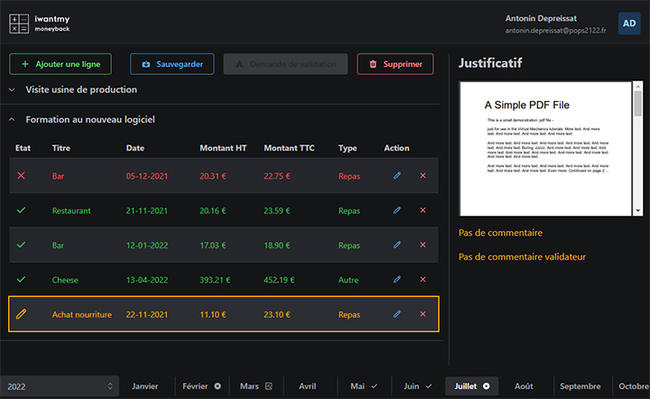

# Projet-GL

This is a [Next.js](https://nextjs.org/) project bootstrapped with [`create-next-app`](https://github.com/vercel/next.js/tree/canary/packages/create-next-app).

[](https://github.com/0xWryth/Projet-GL/actions)
[](https://github.com/0xWryth/Projet-GL/actions)



## Getting Started

These instructions will get you a copy of the project up and running on your local machine for development purpose.

### Prerequisites

Things you need to install the project :

- [npm][10]

### Installing

Here are some instructions on how to get the development env running.

First, clone this repository with the following command :

```bash
git clone https://github.com/0xWryth/Projet-GL.git
```

Then, you must install the project's dependencies :

```bash
npm install
```

### Development

First, run the development server:

```bash
npm run dev
# or
yarn dev
```

Open [http://localhost:3000](http://localhost:3000) with your browser to see the result.

You can start editing the page by modifying `pages/index.tsx`. The page auto-updates as you edit the file.

[API routes](https://nextjs.org/docs/api-routes/introduction) can be accessed on [http://localhost:3000/api/hello](http://localhost:3000/api/hello). This endpoint can be edited in `pages/api/hello.ts`.

The `pages/api` directory is mapped to `/api/*`. Files in this directory are treated as [API routes](https://nextjs.org/docs/api-routes/introduction) instead of React pages.

#### Database config

Before going any further, the `.env` file must be configured.

Next to `SECRET=`, specify a [salt](https://en.wikipedia.org/wiki/Salt_(cryptography)) generated locally with `openssl rand -base64 32` command.

```
SECRET=

# NEXT AUTH
NEXTAUTH_URL=http://localhost:3000

# DATABASE
DB_CONNECTION=mariadb
DB_HOST=localhost
DB_USERNAME=root
DB_PASSWORD=example
DB_DATABASE=
DB_PORT=3306
DB_SYNCHRONIZE=true
DB_LOGGING=false
ENTITIES=
```

You also need to complete `DB_DATABASE=` with the name of the database created locally (thanks to your desktop [MariaDB](https://mariadb.org/) installation or the docker container described below).

> Assuming you have [docker](https://docs.docker.com/get-docker/) installed, execute the following command to run a MariaDB image :
> 
> ```bash
> npm run db
> ```


### Front-end testing
#### Configuration

As a randomly generated database would not comply with test scenarios, you must load a test-dedicated database named `DbFinal.sql` located in `cypress/fixtures` using phpMyAdmin dashboard.

#### Run tests

To run your first tests, you can use the following command, **once the dev server is running**:

```bash
npm run cypress
```

<!--
To run a set of tests in a specific folder
```bash
???
```
To run a specific test method
```bash
???
```
-->

#### Create your test

Please create new functional tests (`.js` files) under `cypress/integration/projet-gl` if you want them to run automatically in CI.

See [cypress documentation](https://docs.cypress.io/guides/getting-started/writing-your-first-test#Write-your-first-test) to learn how to write test scenarios.


## Learn More

To learn more about Next.js, take a look at the following resources:

- [Next.js Documentation](https://nextjs.org/docs) - learn about Next.js features and API.
- [Learn Next.js](https://nextjs.org/learn) - an interactive Next.js tutorial.

You can check out [the Next.js GitHub repository](https://github.com/vercel/next.js/) - your feedback and contributions are welcome!

To learn React, check out the [Create React App documentation][20] and the [React documentation](https://reactjs.org/).


## Deploy on Vercel

The easiest way to deploy your Next.js app is to use the [Vercel Platform](https://vercel.com/new?utm_medium=default-template&filter=next.js&utm_source=create-next-app&utm_campaign=create-next-app-readme) from the creators of Next.js.

Check out our [Next.js deployment documentation](https://nextjs.org/docs/deployment) for more details.

---

### Revision history

#### Version 1.0.0

Project creation. Read the [v1.0.0 release][30] changelog for more information.

- Homepage
- Authentication
	- Login
	- Logout
- User homepage
- User menu
- Validator homepage

---

### Built with


<!-- Mantine ? -->


[10]: https://www.npmjs.com/get-npm
[20]: https://facebook.github.io/create-react-app/docs/getting-started
[30]: https://github.com/0xWryth/Projet-GL/releases/tag/v1.0.0